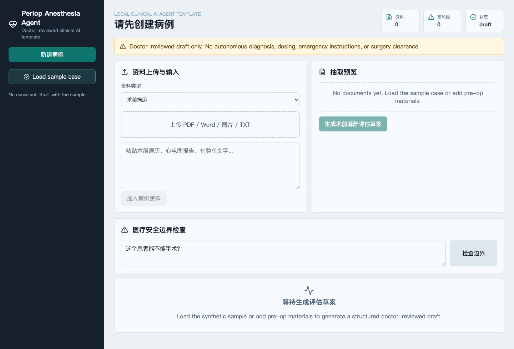
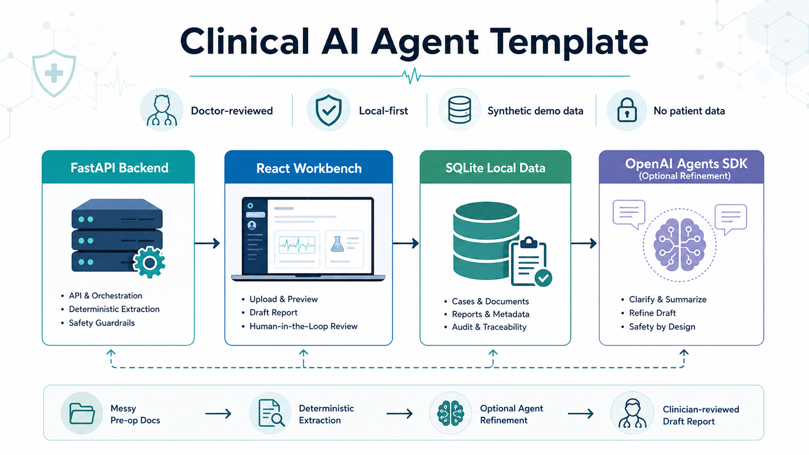
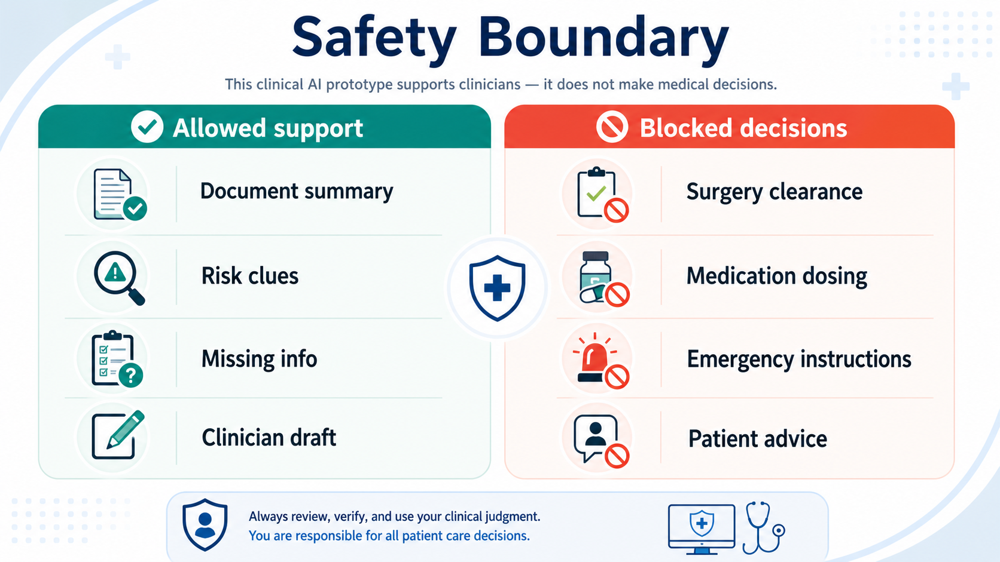
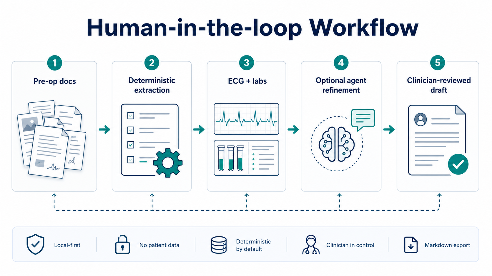
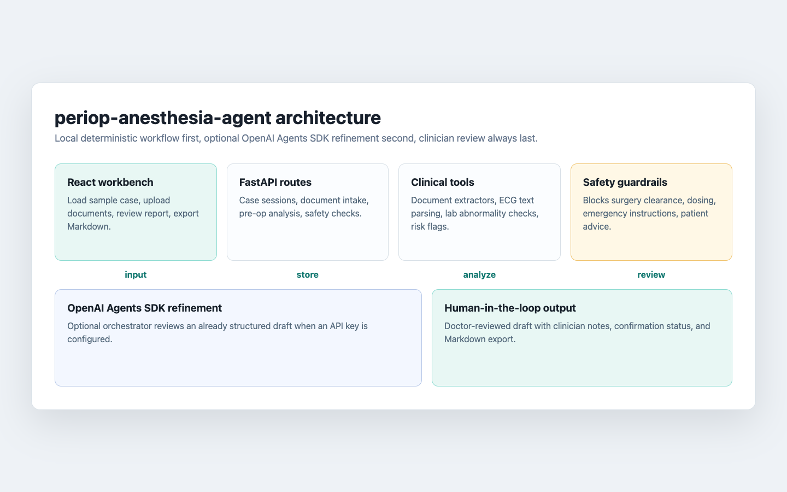
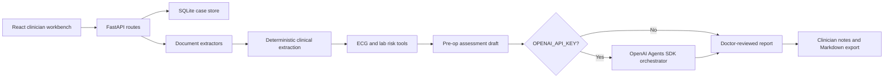

# periop-anesthesia-agent

**Language:** English | [中文](docs/README.zh-CN.md) | [日本語](docs/README.ja.md) | [한국어](docs/README.ko.md) | [Français](docs/README.fr.md) | [Deutsch](docs/README.de.md)

**A doctor-reviewed clinical AI agent template built with FastAPI, React, SQLite, and the OpenAI Agents SDK.**




This repository is a local, human-in-the-loop prototype for perioperative anesthesia assessment. It turns synthetic pre-op notes, ECG text, and lab snippets into a structured draft that a clinician can review, edit, confirm, and export.

It is designed as a reusable clinical AI engineering template, not as a production medical device.

## Project at a Glance

**In one sentence:** this is a doctor-reviewed local clinical AI agent template that uses perioperative anesthesia assessment as a realistic scenario for turning messy medical documents into a reviewable, traceable, exportable draft.

It is not trying to replace clinicians. It answers a more practical engineering question:

> How can an AI system organize clinical source material, surface risk clues, and list missing information while keeping final judgment with the clinician?

| Clinical input | Raw state | What this repo demonstrates |
| --- | --- | --- |
| Pre-op notes | History, medication, allergy, and anesthesia details are mixed in free text | Extract patient context, history, medications, and review clues |
| ECG report text | Rhythm, rate, QTc, ST-T changes, and missing fields are mixed together | Structure ECG findings and anesthesia-relevant risk notes |
| Lab snippets | Hb, creatinine, electrolytes, and other values appear in fragments | Extract key labs and flag anesthesia-relevant abnormalities |
| Clinician review | AI output still needs human editing and confirmation | Provide notes, confirmation status, and Markdown export |

```text
Synthetic pre-op materials
  -> deterministic local extraction
  -> ECG / lab / risk tools
  -> optional OpenAI Agents SDK refinement
  -> clinician review, confirmation, and export
```

The important design choice: the deterministic workflow is local and testable first; model-based refinement is optional and stays behind the clinician-review boundary.

## Maintainer and Build Stack

| Maintainer | Built with |
| --- | --- |
| <a href="https://github.com/2023Anita"><br><strong>2023Anita</strong></a><br>Physician building practical clinical AI tools. |   <br>Codex is credited as an AI engineering tool, not as a human contributor. |

## Visual Overview

| Clinical AI template | Safety boundary | Human-in-the-loop workflow |
| --- | --- | --- |
|  |  |  |

## Why This Exists

Clinical AI demos often skip the hard parts: messy source documents, safety boundaries, deterministic fallback behavior, and clinician review. This project keeps those parts visible.

- Local FastAPI backend with SQLite persistence
- React/Vite clinician workbench
- Synthetic sample case for a 30-second demo
- Deterministic extraction workflow when no API key is configured
- Optional OpenAI Agents SDK refinement when `OPENAI_API_KEY` is available
- Safety guardrails for surgery clearance, medication dosing, emergency instructions, and patient-facing advice
- Markdown export for clinician-reviewed drafts

## For Clinical AI Developers

Use this repo as a practical starting point for local, human-reviewed clinical AI apps:

- Keep deterministic extraction and safety checks testable before adding model refinement.
- Treat agent output as a draft artifact, not as a clinical decision.
- Store only local demo data by default.
- Make clinician review, export, and traceability visible in the UI.
- Separate UI localization from clinical report translation.

## 60-Second Demo

For the fastest local demo:

```bash
./scripts/start-demo.sh
```

Then open `http://127.0.0.1:5173`, click **Load sample case**, review the draft, and export Markdown.

The script starts the backend on `8010` and the frontend on `5173`. Press `Ctrl+C` in the script terminal to stop both.

## 3-Minute Manual Quickstart

```bash
git clone <your-fork-or-repo-url>
cd "periop-anesthesia-agent"
```

Start the backend:

```bash
cd "backend"
python3 -m venv ".venv"
source ".venv/bin/activate"
pip install -e ".[dev]"
uvicorn app.main:app --reload --port 8010
```

Start the frontend in another terminal:

```bash
cd "frontend"
npm install
npm run dev
```

Open `http://127.0.0.1:5173`, click **Load sample case**, then review and export the generated draft.

Optional OpenAI Agents SDK refinement:

```bash
export OPENAI_API_KEY="sk-..."
```

Without an API key, the app still runs with the local deterministic workflow.

## Architecture





The OpenAI Agents SDK layer is intentionally a refinement layer. The baseline workflow remains deterministic and testable so the demo can run locally without network calls.

## Safety Boundary

This project is a doctor-facing assistant prototype. It must not be used as an autonomous diagnosis, treatment, dosing, or surgery-clearance system.

It refuses or redirects requests that ask for:

- Whether a patient can or cannot have surgery
- Anesthesia or medication dosage
- Emergency rescue instructions
- Medication stop/switch/bridging decisions
- Patient-facing individualized medical advice

All generated content is a draft for clinician review only.

## Example Output

The synthetic sample case produces a structured report with:

- Patient context: age, sex, planned surgery, history, medications, allergies
- ECG findings: rhythm, heart rate, QTc, ST-T changes, missing ECG fields
- Lab findings: Hb, creatinine, and interpretation
- Risk flags: cardiovascular risk, antiplatelet/bleeding risk, ECG-related risk
- Missing information and follow-up questions
- Additional checks and monitoring focus
- Safety notice and clinician confirmation status

Reports can be exported as Markdown from the web UI.

## Tests

```bash
cd "backend"
".venv/bin/python" -m pytest
```

Current coverage includes:

- Case creation, document input, and pre-op analysis
- One-click sample demo flow
- Markdown report export
- ECG text extraction
- Lab abnormality detection
- Safety guardrails
- OpenAI Agents SDK orchestrator construction

Frontend production build:

```bash
cd "frontend"
npm run build
```

## Repository Topics

Recommended GitHub topics:

`openai-agents-sdk`, `clinical-ai`, `healthcare-ai`, `fastapi`, `react`, `sqlite`, `human-in-the-loop`, `medical-ai`

## Roadmap

- Export clinician-reviewed reports to PDF
- Add English synthetic sample data
- Add structured safety evaluation cases
- Add optional tracing view for Agents SDK refinement
- Add Docker Compose for one-command startup
- Add more clinician-reviewed synthetic perioperative scenarios

## Contributing

Useful contributions are welcome, especially:

- Safer clinical AI UX patterns
- Better synthetic sample cases
- Tests for safety boundaries and edge cases
- Documentation improvements for clinical AI developers
- Small, reviewable frontend polish

Please keep medical claims conservative. This repository is a developer template and local prototype, not a production medical system.

Good starting points:

- Add an English synthetic sample case.
- Add a Docker Compose demo path.
- Add a PDF export option.
- Add more safety eval fixtures.
- Improve multilingual UI copy.

## More Docs

- [Chinese README](docs/README.zh-CN.md)
- [Code of conduct](CODE_OF_CONDUCT.md)
- [Citation metadata](CITATION.cff)
- [Launch checklist](docs/launch-checklist.md)
- [Safety evals](docs/safety-evals.md)

## License

MIT
